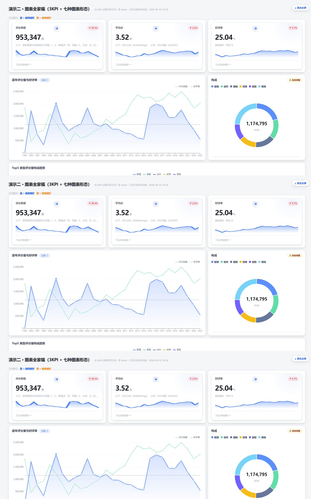
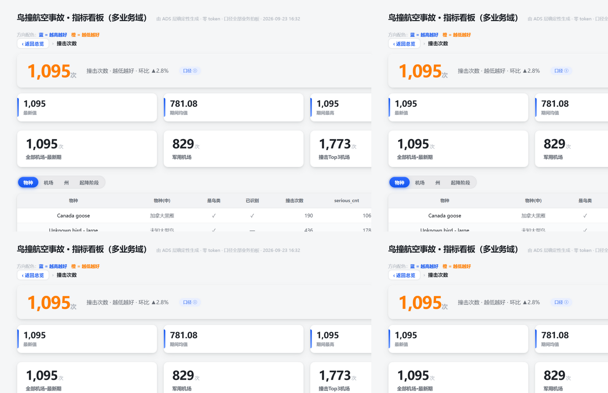
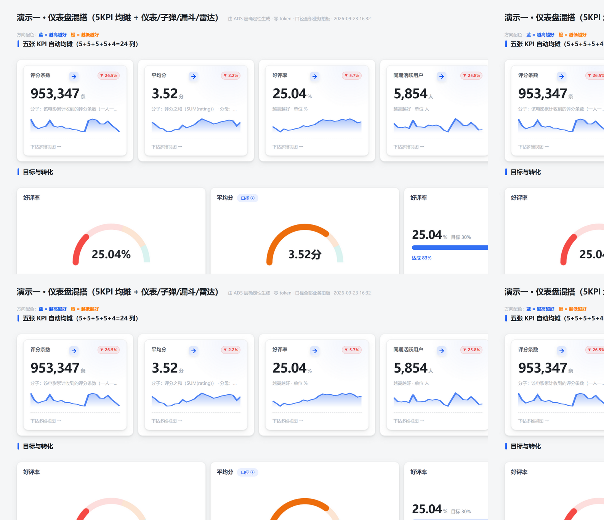
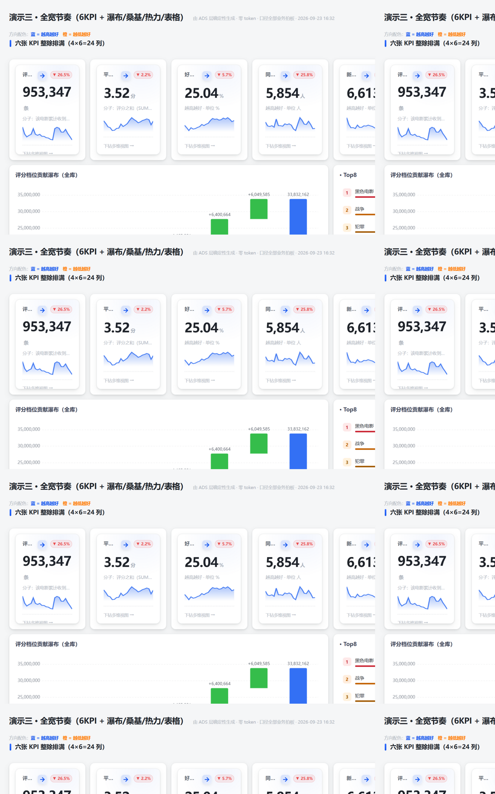

# DSH Dashboard

**你说一句话，AI 自动把你的数据变成能看的看板——自动选图表、自动排布局、能点进去看每条明细。**

## 怎么用

装完插件，在 DSH 对话里直接说"帮我做个看板"就行了。

## 它做了什么

1. **自动拼数据**——AI 读你的数据库，自己判断什么数据配什么图表
2. **自动排布局**——不需要拖拽排版，页面自动填满不留空白，主次分明错落有致
3. **能看明细**——点指标卡 → 看维度分解 → 再点 → 看到逐条原始记录

## 其他

飞书风格 · 17 种图表 · 单文件离线 · 全屏展示 · 口径卡 · 生成闸门

## 安装

```bash
dsh plugin add dsh-dashboard-ai
```

## 效果预览






## License

MIT
