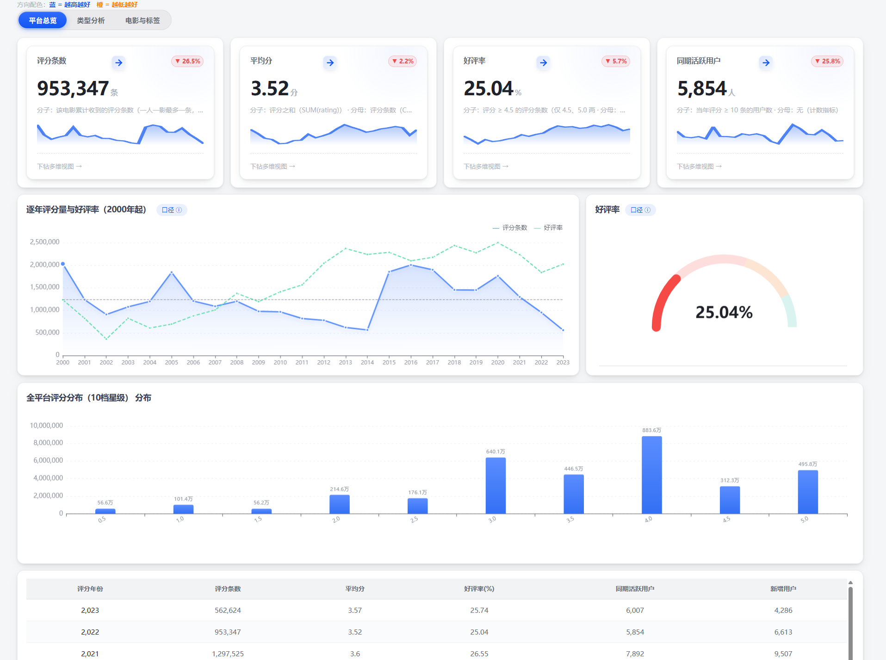
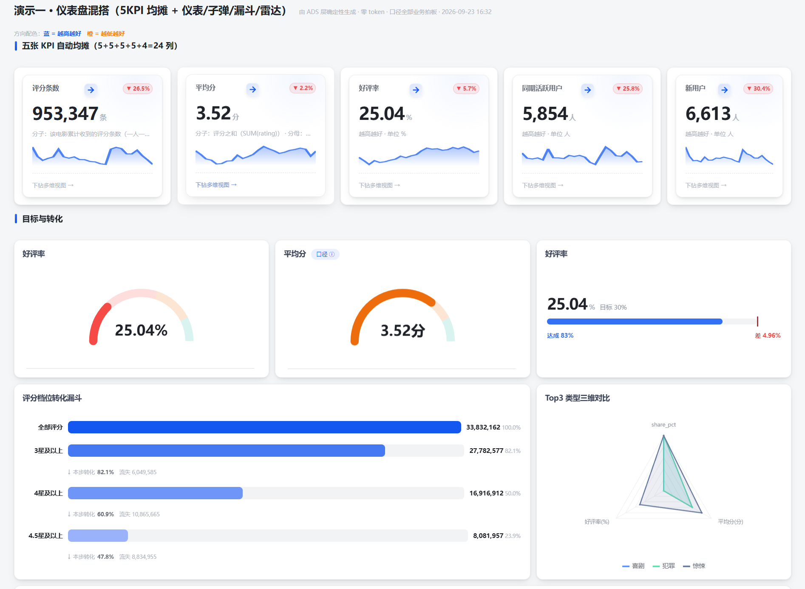
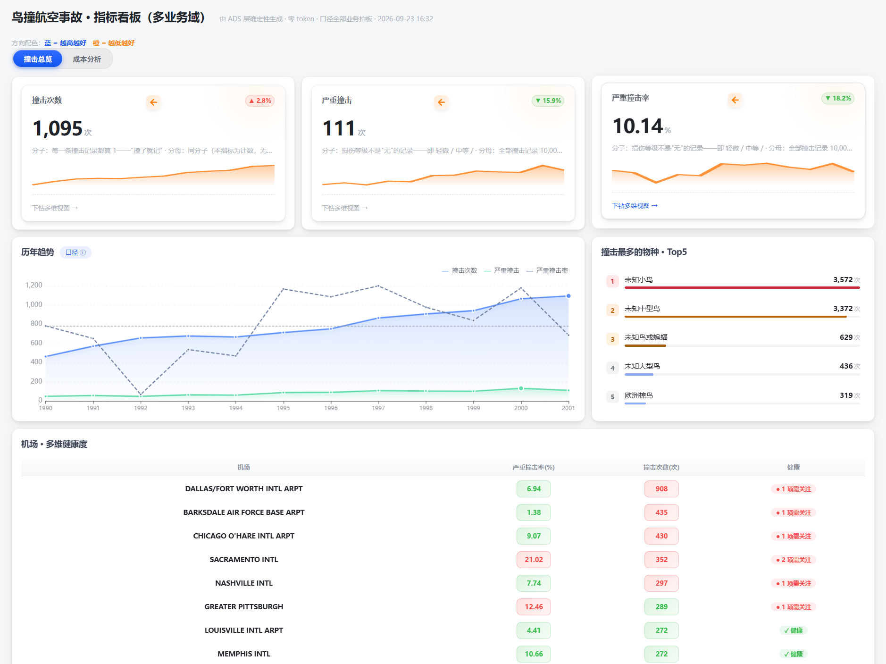
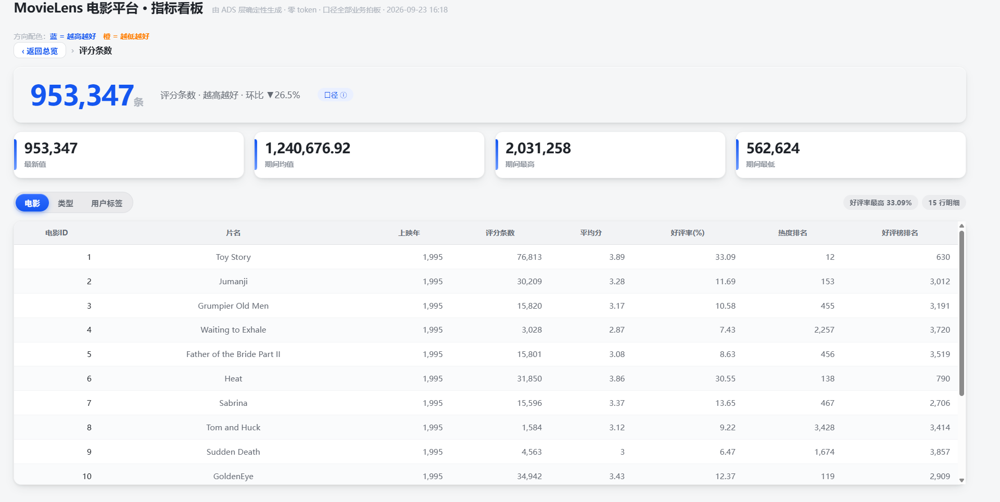
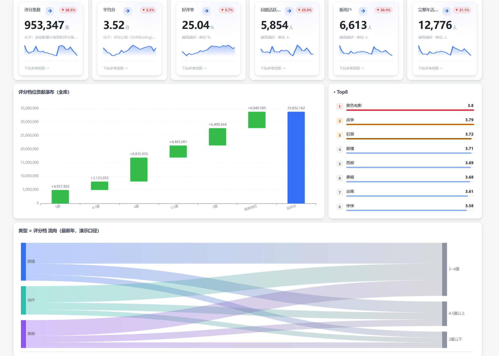

# DSH Dashboard AI · AI 通用看板插件

**你说一句话，AI 自动把你的数据变成能看的看板——自动选图表、自动排布局、能点进去看每条明细。**

**Just say one sentence — AI turns your data into an interactive dashboard with auto-selected charts, auto-layout, and drill-down to individual records.**

## 怎么用 | How to Use

装完插件，在 DSH 对话里直接说"帮我做个看板"就行了。

After installing, just say "make me a dashboard" in the DSH conversation.

## 它做了什么 | What It Does

1. **自动拼数据** — AI 读你的数据库，自己判断什么数据配什么图表
   **Auto-stitch data** — AI reads your database and picks the right chart for each metric

2. **自动排布局** — 不需要拖拽排版，页面自动填满不留空白，主次分明错落有致
   **Auto-layout** — No drag-and-drop needed. Pages fill completely with clear visual hierarchy

3. **能看明细** — 点指标卡 → 看维度分解 → 再点 → 看到逐条原始记录
   **Drill-down details** — Click KPI card → dimension breakdown → click again → individual records

## 其他特性 | Features

飞书风格 · 17 种图表 · 单文件离线 · 全屏展示 · 口径卡 · 生成闸门

Feishu design · 17 chart types · Offline single-file · Fullscreen · Metric caliber cards · Generation gate

## 安装 | Install

```bash
dsh plugin add github:33Wade333/dsh-dashboard-ai
```

## 效果预览 | Preview


*多图拼接 — 10 种组件自动排满一页 | Multi-chart — 10 components auto-arranged*


*维度分解下钻 — 点 KPI 卡看维度分解 | Drill-down — Click KPI to see dimension breakdown*


*仪表盘混搭 — KPI + 仪表盘 + 子弹图 + 漏斗 + 雷达 | Mixed — KPI + Gauge + Bullet + Funnel + Radar*


*全宽节奏 — 瀑布 + 桑基 + 热力 + 表格 | Full-width — Waterfall + Sankey + Heatmap + Table*


*看板总览 — 多域切换 + KPI + 图表 + 明细 | Overview — Multi-domain + KPI + Charts + Details*

## 搭配使用 | Companion

本插件搭配 **data-model-builder** Skill 使用效果最佳——Skill 教 AI 从零建数据模型（四层数仓+口径统一），插件负责把建好的数据变成可交互看板。

**Pair with the data-model-builder Skill** for the full experience — the Skill teaches AI to build data models (4-layer warehouse + unified calibers), this plugin turns the data into interactive dashboards.

👉 https://github.com/33Wade333/data-model-builder

## License

MIT
